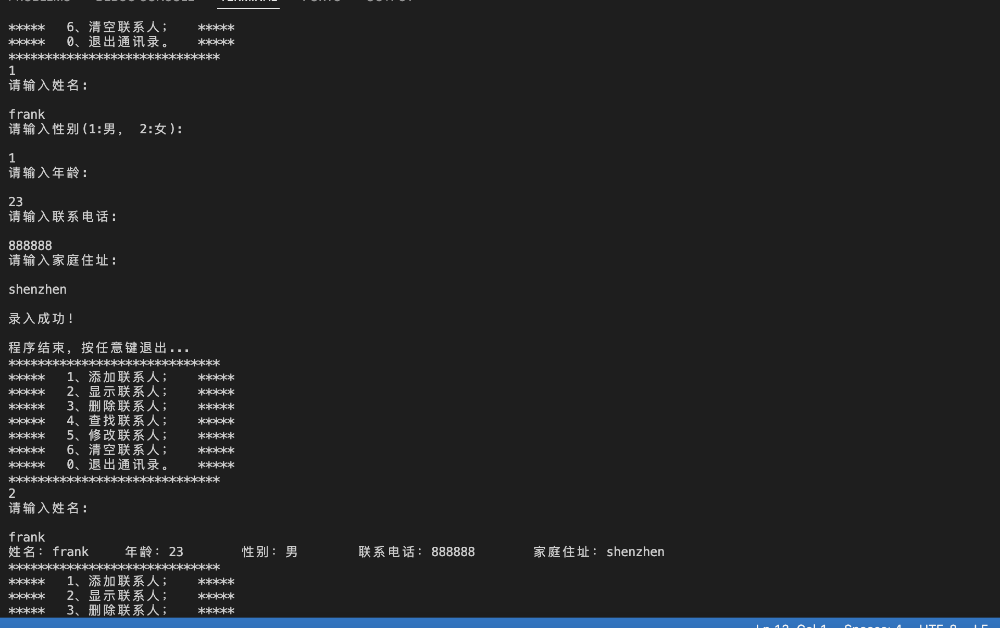
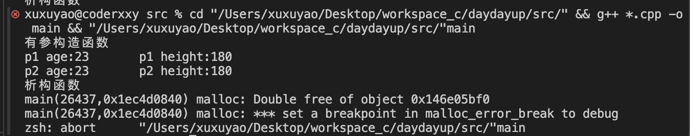
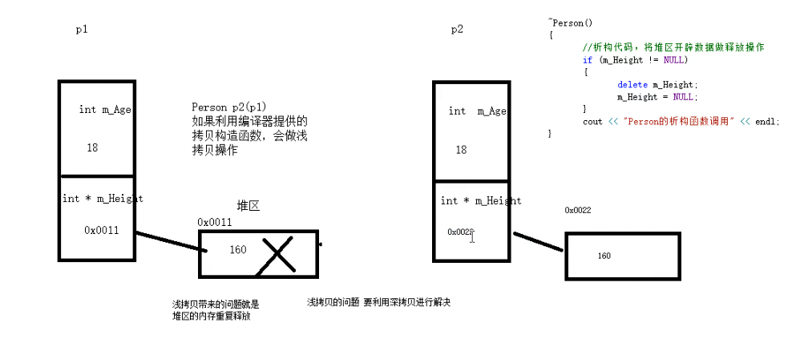
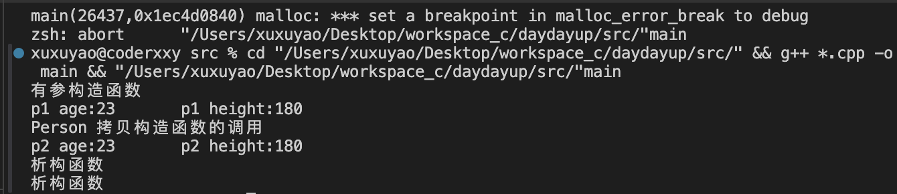

# 每日更新内容:
* [2025.03.09 通讯录管理系统功能](#2025.03.09)
* [2025.03.10 内存四区（代码区、全局区、栈区、堆区）](#2025.03.10)
* [2025.03.13 分文件{h,m}案例](#2025.03.13)
* [2025.03.15 类和对象](#2025.03.15类和对象)


## 2025.03.09
 * 通讯录管理系统功能【最大上限1000，包含（姓名、性别、年龄、联系电话、家庭地址）】
 * 1、添加；
 * 2、显示；
 * 3、删除；
 * 4、查找；
 * 5、修改；
 * 6、清空；
 * 0、退出通讯录.



## 2025.03.10
### 内存四区（代码区、全局区、栈区、堆区）
    1、代码区
    2、全局区:全局变量、静态变量、常量（字符串常量、const修饰的全局变量）
    3、栈 区:编译器自动分配、释放，存放函数的参数值，局部变量等；⚠️【不要返回局部变量的地址,栈区的数据在函数执行完后自动释放】
    4、堆 区:开发者分配、释放，若不释放，程序结束后由系统回收。
    
### 总结：
    程序运行前：
    * c++中在程序运行前分为全局区和代码区；
    * 代码区特点是共享和只读；
    * 全局区中存放全局变量、静态变量、常量
    * 常量区中存放`const修饰的全局常量`和`字符串常量`。

### 程序运行后：
    * 程序运行后分为栈区、堆区；
    * 栈区特点是编译器自动开辟、释放内存，存放函数的参数值（形参）、局部变量；
    * 堆区特点是由开发者手动开辟、释放内存，若未释放则在程序结束后由系统回收。

### 引用的作用：给变量起别名
    语法：`数据类型 &别名 = 原名`

## 2025.03.13
封装案例：求立方体的面积、体积以及分别用全局、局部函数判断两个立方体是否相等
`int calculateS(); // 求s`
`int calculateV(); // 求v`
`bool isSameByClass (rectangledemo &r); // 局部函数`
`bool isSameRectangle(rectangledemo &r1, rectangledemo &r2); // 全局函数`

## 2025.03.15 类和对象

浅拷贝：赋值拷贝操作；
深拷贝：在堆区重新申请空间，进行拷贝操作。
`总结：如果属性有在堆区开辟空间的，一定要自己提供拷贝构造函数，防止浅拷贝带来的问题`

```
class Person
{
private:
    /* data */
public:
    // 默认提供的无参构造函数
    Person(/* args */);
    // 默认提供的析构函数
    ~Person();
    // 自定义构造函数
    Person(int age);
    Person(int age, int height);
    // 自定义拷贝构造函数 解决浅拷贝带来的问题
    Person(const Person &p);
    int m_age;      // 年龄
    int *m_height;  // 身高
};
```



解决方案

```
Person::Person(const Person &p)
{
    cout<<"Person 拷贝构造函数的调用"<<endl;
    m_age = p.m_age;
    // m_height = p.m_height; // 编译器默认实现代码
    // 深拷贝
    m_height = new int(*p.m_height);
}
```
